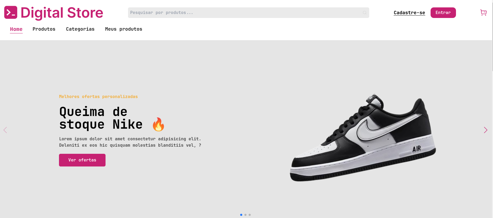

# E-commerce Responsivo 
Projeto Front end Geração Tech


# Tecnologias utilizadas
- React
- Vite
- Javacript

## Como clonar o repositório

Para clonar o repositório, use o seguinte comando no terminal:

```bash
git clone https://github.com/usuario/nome-do-repositorio.git
```

Instalar Dependências
```bash
npm install
```

Inicializando o projeto
```bash
npm run dev
```

## Créditos
Prototipagem do Projeto: [Figma](https://www.figma.com/design/cfb4F7ZXMFQmvmTn3PKI4z/DRIP-STORE---DIGITAL-COLLEGE?node-id=22-30)

Documentacao do Projeto: https://github.com/digitalcollegebr/projeto-digital-store
## 🤝 Colaboradores

Desenvolvedores responsáveis pelo projeto:

<table>
  <tr>
    <td align="center">
      <a href="https://github.com/henrymzs" title="link github">
        <br>
        <sub>
          <b>Henry</b>
        </sub>
      </a>
    </td>
    <td align="center">
      <a href="https://github.com/IporanRM" title="link github">
        <br>
        <sub>
          <b>Iporan</b>
        </sub>
      </a>
    </td>
    <td align="center">
      <a href="https://github.com/Nathan-Mn" title="link github">
        <br>
        <sub>
          <b>Nathan</b>
        </sub>
      </a>
    </td>
  </tr>
</table>
